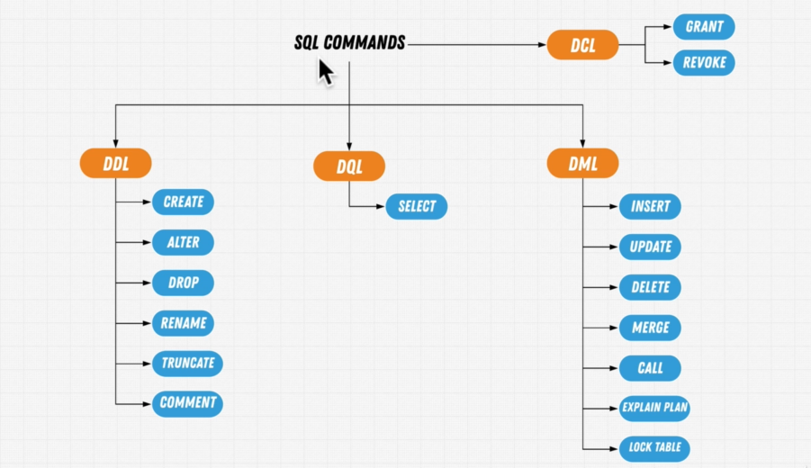
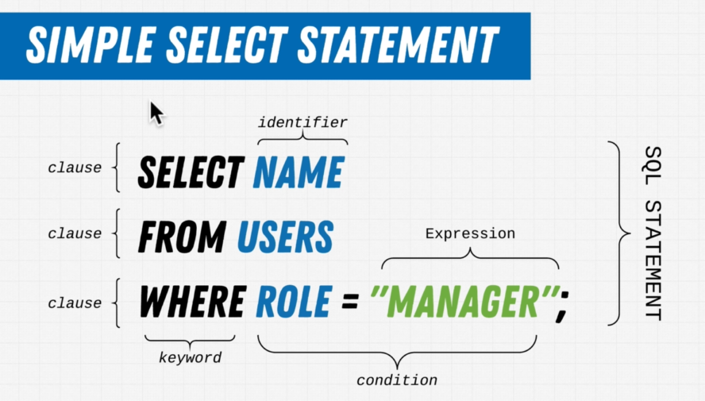

# SQL Queries



1. DDL :- Data Defination Language
2. DQL :- Data Query Language
3. DML :- Data Modification Language
4. DCL :- Data Control Langage


| Category      | Full Form                      | Purpose                                      | Common Commands                      | Examples of Usage                                             |
|---------------|--------------------------------|----------------------------------------------|--------------------------------------|---------------------------------------------------------------|
| **DDL**       | Data Definition Language       | Defines and modifies database structure      | `CREATE`, `ALTER`, `DROP`, `TRUNCATE`| Creating a new table, changing column types, deleting tables  |
| **DQL**       | Data Query Language            | Retrieves data from the database             | `SELECT`                             | Querying data from a table (e.g., selecting rows or columns)  |
| **DML**       | Data Manipulation Language     | Manipulates data in existing tables          | `INSERT`, `UPDATE`, `DELETE`         | Adding new records, modifying existing records, deleting rows |
| **DCL**       | Data Control Language          | Controls access to data                      | `GRANT`, `REVOKE`                    | Granting/revoking user permissions to access specific tables  |

## Simple Select Statement




This SQL statement is very basic and simple , it is selecting name from users database where role of user is amanger.

### What is SELECT (Retrieve Data)

We write `SELECT` to get data back

SELECT statement is DQL is Data Query Language, It is used to retrieve data. 


# 1st Exercise with Select

Q1) Give me a list of all EMPLOYEES in the company.

```sql
SELECT * FROM "employees";
```

Q2) How Many departments are there in the  company?

```sql
SELECT * FROM "departments";
```

Q3) How many times has employee 10001 had a raise?

```sql
SELECT * FROM "salaries";
```

It will give you whole salary table , and where you can count how many has 10001(employee number).

There are some more functionality we have to get only specific data.


ROUGH 

```sql
//create table
-- CREATE TABLE student(ID INT ,FIrstName VARCHAR(50),LastName VARCHAR(50),Age INT);

//insert into table
-- INSERT INTO student(ID,FIrstName,LastName,Age) VALUES(1,'ABhinish','Kumar',23);
INSERT INTO student(ID,FIrstName,LastName,Age) VALUES(2,'Rahul','Roy',26);

//get table
SELECT * from student;

```


